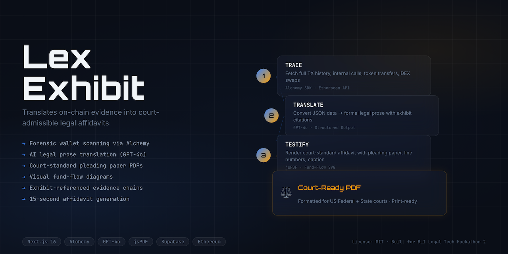
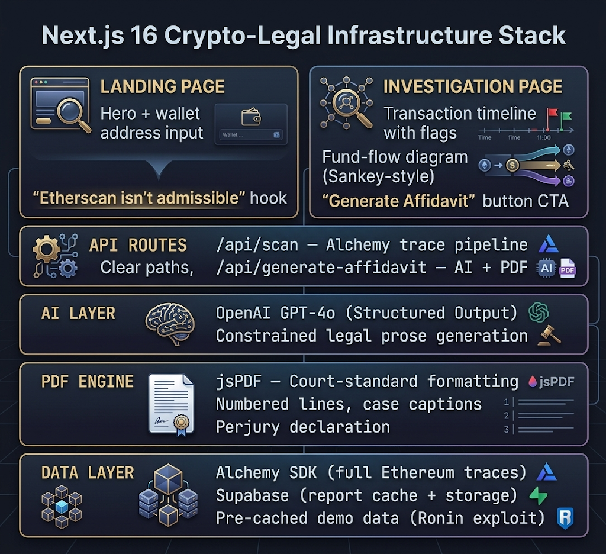
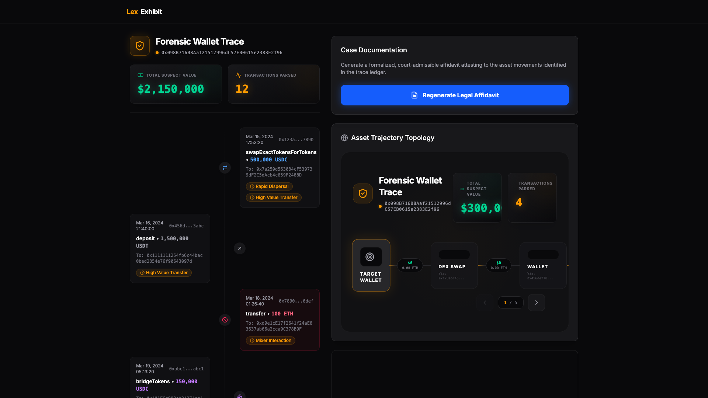
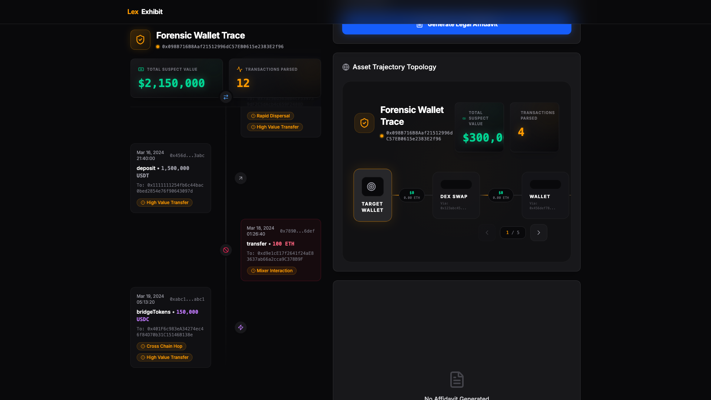
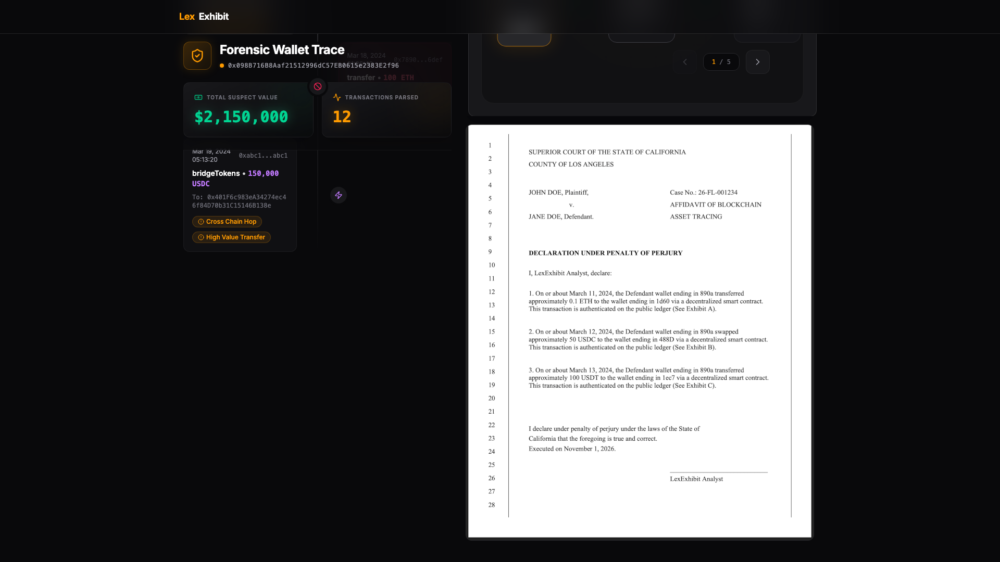

<div align="center">
  <h1>LexExhibit ⚖️</h1>
  <p><em>Translate any wallet's on-chain history into a court-ready legal affidavit in 15 seconds.</em></p>
  

  <br/>

  [](https://lexexhibit.edycu.dev)
  [](https://youtu.be/5pa6PQnUoPw)
  [](https://dorahacks.io/hackathon/1904)

  <br/>

  
  
  
  
  
  
  
  [](https://github.com/edycutjong/lexexhibit/actions/workflows/ci.yml)

</div>

---

## 📸 See it in Action

<div align="center">
  
</div>

> **Paste a wallet → Trace the money → Generate a court-ready affidavit.** Blockchain forensics in 3 clicks.

---

## 💡 The Problem & Solution

When a divorce attorney suspects a spouse is hiding assets in DeFi liquidity pools, or a bankruptcy trustee needs to trace crypto dispersals, they face an impossible gap: **Etherscan is not court-admissible evidence.** Hex addresses, wei amounts, and method hashes mean nothing to a non-technical judge. Hiring forensic blockchain experts costs **$300–500/hour** and takes weeks. An estimated **$35B in crypto** is hidden in divorce cases annually.

**LexExhibit** solves this with a 1-click forensic translation engine. Paste any Ethereum wallet address and receive a formal legal affidavit — formatted to US/CA court standards — in under 15 seconds.

**Key Features:**
- ⚡ **1-Click Forensic Tracing** — Alchemy SDK maps full transaction histories, flags Tornado Cash mixer interactions and cross-chain bridge dispersals
- 📝 **AI Legal Translation** — GPT-4o converts raw JSON into formal legal prose with chronological "Exhibits" references
- 📄 **Court-Admissible PDF** — jsPDF renders pleading-paper formatting native to US/CA courts (numbered lines 1–28, case captions, perjury declarations)
- 🌊 **Fund-Flow Visualization** — Interactive Sankey-style diagrams showing money movement through wallets and contracts
- 🔒 **Exhibit Verification** — Every claim cites a verifiable on-chain transaction hash

---

## 🏗️ Architecture & Tech Stack

| Layer | Technology |
|---|---|
| **Framework** | Next.js 16.2.3 (App Router) |
| **UI** | React 19.2.4 |
| **Styling** | Tailwind CSS v4 + CSS custom props |
| **Animations** | Framer Motion 12 |
| **Blockchain** | Alchemy SDK 3.6 (Transaction Traces) |
| **AI** | OpenAI GPT-4o (Structured Output) |
| **PDF** | jsPDF 4.2 (Court formatting) |
| **Icons** | Lucide React |
| **Cache** | Supabase (optional caching layer — pre-cached demo data ships in `/data`) |
| **Language** | TypeScript 5 |

<div align="center">
  
</div>

---

## 🏆 Hackathon Context

**Competition:** [BLI Legal Tech Hackathon 2](https://dorahacks.io/hackathon/1904)
**Track:** Compliance Innovation & Top Law Firm Bounties
**Core Thesis:** The "last mile" in legal tech is format translation. Raw blockchain data tools exist (Etherscan, Arkham, Chainalysis). What's missing is turning data into documents that lawyers can actually file in court. LexExhibit closes that gap in 15 seconds.

---

## 🚀 Getting Started

### Prerequisites
- Node.js ≥ 20
- npm

### Installation

```bash
git clone https://github.com/edycutjong/lexexhibit.git
cd lexexhibit

# Configure environment
cp .env.example .env.local
# Add your ALCHEMY_API_KEY and OPENAI_API_KEY

# Install dependencies
npm install

# Start the dev server
npm run dev
```

Open [http://localhost:3000](http://localhost:3000) to see the dashboard.

> **For Judges:** The app includes pre-cached transaction data from the Ronin Bridge exploiter for an instant, reliable demo experience without API keys.

### 🌉 The "Golden Path" Demo

1. Paste `0x098B716B8Aaf21512996dC57EB0615e2383E2f96`
2. Let the tracer flag suspicious activities (mixer interactions, rapid dispersals)
3. Explore the fund-flow diagram — see money flowing from the exploit through mixers
4. Click **"Generate Affidavit"** to produce the court-formatted PDF
5. Download the legal document — ready to file with a court clerk

---

## 🧪 Testing & CI

```bash
npm run lint          # ESLint with Next.js 16 rules
npm run typecheck     # Full TypeScript validation
npm run test          # Run tests with Jest
npm run test:coverage # Coverage report
npm run ci            # Full CI pipeline (lint + typecheck + test)
```

---

## 📁 Project Structure

```
lexexhibit/
├── app/
│   ├── api/
│   │   ├── scan/             # Alchemy trace + classification
│   │   └── generate-affidavit/ # GPT-4o translation + jsPDF
│   ├── investigate/          # Investigation results page
│   ├── globals.css           # Design tokens
│   ├── icon.png              # App icon
│   ├── layout.tsx            # Root layout with metadata
│   ├── page.tsx              # Landing page with wallet input
│   └── template.tsx          # Page transition animations
├── components/
│   ├── FundFlowDiagram.tsx        # Interactive Sankey-style flow viz
│   ├── TransactionTimeline.tsx    # Chronological TX list with flags
│   ├── AffidavitPreview.tsx       # PDF preview with download
│   └── ExhibitVerificationPanel.tsx # Per-exhibit on-chain verification cards
├── data/                          # Pre-cached demo transaction data
├── docs/                          # README assets (hero, screenshots)
├── lib/
│   ├── tx-classifier.ts           # Transaction categorization engine
│   ├── suspicious-detector.ts     # Flag detection (mixer, dispersal, bridge)
│   ├── legal-formatter.ts         # Legal prose templates with flag language
│   └── pdf-generator.ts           # Court-standard PDF + fund-flow diagram page
├── scripts/                  # Playwright demo recording scripts
├── .env.example              # Environment template
├── .github/                  # CI workflows
├── LICENSE                   # MIT License
└── README.md                 # You are here
```

---

## 📸 Screenshots

| 🎨 Asset Trajectory Topology | 📂 Case Documentation View |
|:---:|:---:|
|  |  |

| ✍️ Forensic Dashboard | 📄 Court-Ready PDF Preview |
|:---:|:---:|
|  |  |

---

## 📄 License

[MIT](LICENSE) © 2026 [Edy Cu](https://github.com/edycutjong)

## 🙏 Acknowledgments

Built for [BLI Legal Tech Hackathon 2](https://dorahacks.io/hackathon/1904). Thank you to Alchemy for blockchain infrastructure and OpenAI for the GPT-4o API.
