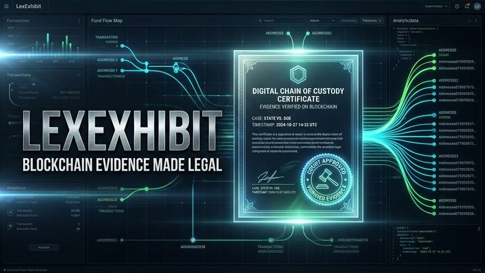

<p align="center">
  
</p>

<h1 align="center">⚖️ LexExhibit</h1>
<p align="center"><strong>Court-Admissible Blockchain Forensics</strong></p>

<p align="center">
  
  
  
  
  
</p>

> **The truth is on-chain. But justice happens in court.**

> 🏆 Built for **[BLI Legal Tech Hackathon 2](https://dorahacks.io/hackathon/1904)** (DoraHacks)
> 🏅 Track: **Compliance Innovation & Top Law Firm Bounties**

LexExhibit is a 1-click forensic translation engine. It converts any Ethereum wallet's on-chain history into a **beautifully formatted, court-ready legal affidavit** — bridging the gap between blockchain data and courtroom evidence.

---

## 📹 Demo
[Live Demo](https://lexexhibit.edycu.dev) | [Video Link](https://youtu.be/5pa6PQnUoPw)

[](https://youtu.be/5pa6PQnUoPw)

*Click the image above to watch the 35-second forensic walkthrough.*

---

## 🎯 Problem

When a divorce attorney suspects a spouse is hiding assets in DeFi liquidity pools, or a bankruptcy trustee needs to trace crypto dispersals, they face an impossible gap:

> **Etherscan is not court-admissible evidence.**

- Hex addresses, wei amounts, and method hashes mean nothing to a non-technical judge
- Hiring forensic blockchain experts costs **$300-500/hour** and takes weeks
- **$35B in crypto** is estimated hidden in divorce cases annually

## 💡 Solution

**LexExhibit** translates blockchain chaos into court-ready documents. Paste a wallet address → Get a formal legal affidavit in **under 15 seconds**.

**Three-stage pipeline:**

1. **🔍 Trace** — Alchemy SDK fetches complete transaction history. Transactions are classified (transfers, swaps, LP deposits, bridge hops) and flagged for suspicious patterns (rapid dispersals, mixer interactions)

2. **📝 Translate** — GPT-4o converts raw JSON into formal legal prose using constrained prompts: "On or about March 15, 2026, the Defendant wallet transferred 50,000 USDC to a decentralized exchange smart contract..."

3. **📄 Testify** — jsPDF renders the translated content into a court-standard affidavit with pleading paper formatting (numbered lines 1-28, standard case captions, perjury declarations)

**Key features:**
- **1-Click Forensic Tracing** — Maps out transaction behaviors, flags Tornado Cash mixer interactions and cross-chain bridge dispersals
- **AI Legal Translation** — Plain-English legal prose with chronological "Exhibits" references
- **Court-Admissible PDF** — Pleading-paper formatting native to US/CA court standards
- **Fund-Flow Visualization** — Interactive Sankey-style diagrams showing money movement
- **Exhibit Verification** — Every claim cites a verifiable on-chain transaction hash

---

## 🏗️ Architecture


---

## 🛠️ Tech Stack

| Layer       | Technology                          |
| ----------- | ----------------------------------- |
| Framework   | Next.js 16.2.3 (App Router)         |
| UI          | React 19.2.4                        |
| Styling     | Tailwind CSS v4 + CSS custom props  |
| Animations  | Framer Motion 12                    |
| Blockchain  | Alchemy SDK 3.6 (Transaction Traces)|
| AI          | OpenAI GPT-4o (Structured Output)   |
| PDF         | jsPDF 4.2 (Court formatting)        |
| Icons       | Lucide React                        |
| Backend     | Supabase (report storage)           |
| Language    | TypeScript 5                        |

---

## 🚀 Getting Started

### Prerequisites

- **Node.js** ≥ 18
- **npm** ≥ 9

### Installation

```bash
git clone https://github.com/edycutjong/lexexhibit.git
cd lexexhibit

# Provide variables
cp .env.example .env.local
# Add ALCHEMY_API_KEY and OPENAI_API_KEY

# Install dependencies
npm install

# Start the dev server
npm run dev
```

Open [http://localhost:3000](http://localhost:3000) to see the dashboard.

> **Note:** The app includes pre-cached transaction data from the Ronin Bridge exploiter for an instant, reliable demo experience without API keys.

### Development Scripts

| Command | Description |
|---|---|
| `npm run dev` | Start Next.js 16 local dev server |
| `npm run build` | Compile for production |
| `npm run lint` | ESLint with Next.js 16 rules |
| `npm run typecheck` | Full TypeScript validation |
| `npm run demo` | Automated demo recording (Playwright) |

---

## 🌉 The "Golden Path" Demo

Try the instant simulation using the embedded Ronin Bridge exploiter trace:

1. Paste `0x098B716B8Aaf21512996dC57EB0615e2383E2f96`
2. Let the tracer flag suspicious activities (mixer interactions, rapid dispersals)
3. Explore the fund-flow diagram — see money flowing from the exploit through mixers
4. Click **"Generate Affidavit"** to produce the court-formatted PDF
5. Download the legal document — ready to file with a court clerk

---

## 📁 Project Structure

```
lexexhibit/
├── app/
│   ├── api/
│   │   ├── scan/             # Alchemy trace + classification
│   │   └── generate-affidavit/ # GPT-4o translation + jsPDF
│   ├── investigate/          # Investigation results page
│   ├── globals.css           # Design tokens
│   ├── icon.svg              # App icon
│   ├── layout.tsx            # Root layout with metadata
│   ├── page.tsx              # Landing page with wallet input
│   └── template.tsx          # Page transition animations
├── components/
│   ├── FundFlowDiagram.tsx   # Interactive Sankey-style flow viz
│   ├── TransactionTimeline.tsx # Chronological TX list with flags
│   └── AffidavitPreview.tsx  # PDF preview before download
├── data/                     # Pre-cached demo transaction data
├── lib/
│   ├── tx-classifier.ts     # Transaction categorization engine
│   ├── legal-prompt.ts      # AI system prompt for legal prose
│   └── pdf-renderer.ts      # Court-standard PDF formatting
├── scripts/
│   └── demo.js              # Playwright demo recording script
├── .env.example
├── package.json
├── tsconfig.json
└── next.config.ts
```

---

## 🏆 Hackathon Context

**Competition:** [BLI Legal Tech Hackathon 2](https://dorahacks.io/hackathon/1904)  
**Track:** Compliance Innovation & Top Law Firm Bounties  
**Core Thesis:** The "last mile" in legal tech is format translation. Raw blockchain data tools exist (Etherscan, Arkham, Chainalysis). What's missing is turning data into documents that lawyers can actually file in court. LexExhibit closes that gap in 15 seconds.

---

## 📸 Screenshots

| 🎨 Asset Trajectory Topology | 📂 Case Documentation View |
|:---:|:---:|
|  |  |

| ✍️ Affidavit Generation | 📄 Court-Ready PDF Preview |
|:---:|:---:|
|  |  |

## 📄 License

MIT © 2026 [Edy Cu](https://github.com/edycutjong)
